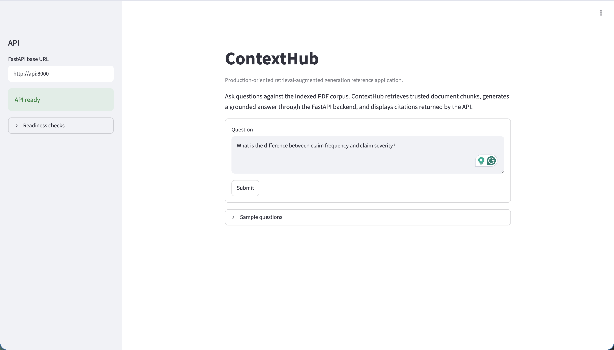
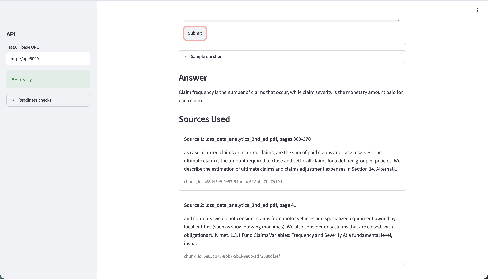
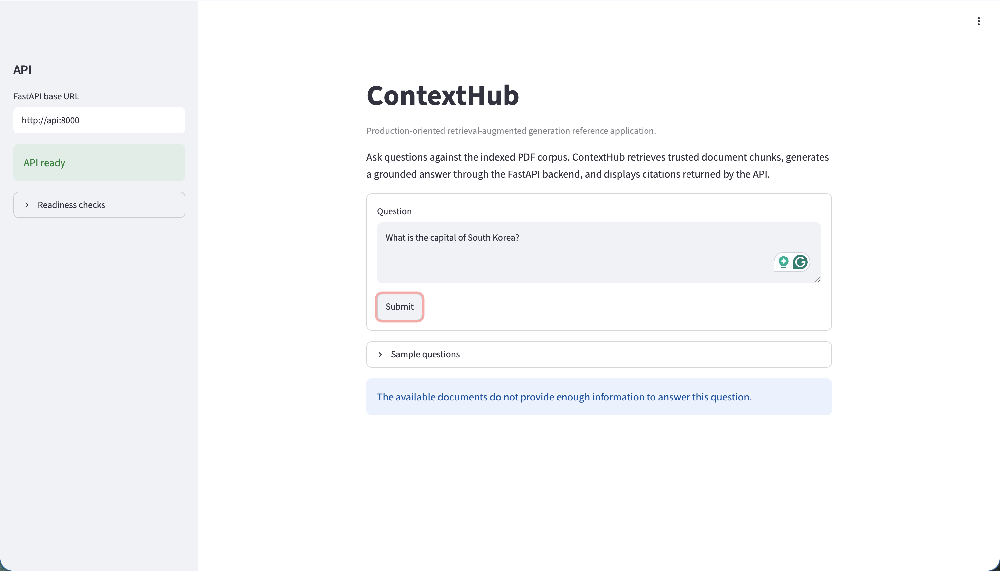

# ContextHub

ContextHub is a retrieval-augmented generation (RAG) application for asking
questions about a fixed PDF corpus. It retrieves relevant passages with
sentence-transformer embeddings and FAISS, asks a hosted Hugging Face model to
answer from that context, and returns citations backed by SQLite metadata.

## Demo Availability

The application was deployed successfully to Google Cloud Run for testing and
demonstration. The live website is currently offline to avoid ongoing cloud
maintenance and hosted LLM usage costs.

The complete application remains available to run locally with Docker or Python.

## Demo Walkthrough

Submit a question about the indexed loss data analytics corpus:



ContextHub returns a grounded answer and the document passages used as sources:



When the corpus does not support a question, the application refuses to answer
instead of relying on the LLM's general knowledge:



## How It Works

```text
OFFLINE INDEX BUILD

PDF files
   |
   v
PyMuPDF text extraction
   |
   v
Page-aware chunks
   |
   +--> SentenceTransformer embeddings --> FAISS vector index
   |
   +-------------------------------------> SQLite source metadata


RUNTIME QUERY

Browser
   |
   v
Streamlit UI
   |
   | POST /v1/query
   v
FastAPI
   |
   +--> Guard query
   +--> Embed question
   +--> Retrieve relevant chunks from FAISS
   +--> Load trusted source metadata from SQLite
   +--> Build a grounded prompt
   +--> Generate a structured answer with Hugging Face
   +--> Validate citations and sensitive output
   |
   v
Answer with document and page citations
```

The browser communicates only with Streamlit. Streamlit calls FastAPI, while
FastAPI owns retrieval, prompt construction, guardrails, generation, and citation
validation. The runtime corpus is read-only; users cannot upload or modify PDFs.

## Try It Locally

You need a Hugging Face token with permission to use Inference Providers. Copy the
example configuration and replace the two placeholder values:

```bash
cp .env.example .env
```

```dotenv
CONTEXTHUB_HUGGINGFACE_MODEL=openai/gpt-oss-20b:fastest
CONTEXTHUB_HUGGINGFACE_API_TOKEN=hf_your_token
```

Never commit `.env` or a real provider token.

### Option 1: Docker

This is the simplest way to run the complete application. The image includes the
built FAISS index, SQLite database, manifest, and embedding model.

```bash
docker compose up --build
```

Open <http://127.0.0.1:8501>. Stop everything with:

```bash
docker compose down
```

Docker Compose runs two containers from the same image:

```text
Browser --> localhost:8501 --> Streamlit container
                                  |
                                  | http://api:8000
                                  v
                              FastAPI container

Host localhost:8000 ----------> FastAPI container (API/docs access)
```

If either host port is occupied:

```bash
CONTEXTHUB_API_PORT=8001 CONTEXTHUB_UI_PORT=8502 docker compose up --build
```

Then open <http://127.0.0.1:8502>.

### Option 2: Python

Use this path for development, debugging, evaluation, or rebuilding the index.
Python 3.12 and [`uv`](https://docs.astral.sh/uv/) are required.

```bash
uv sync
uv run python scripts/run_local.py
```

Open <http://127.0.0.1:8501>. The launcher starts FastAPI first, waits for
readiness, starts Streamlit, and stops both when you press `Ctrl+C`.

For backend auto-reload, run the processes in separate terminals:

```bash
uv run uvicorn contexthub.main:app --reload
```

```bash
CONTEXTHUB_API_BASE_URL=http://127.0.0.1:8000 \
  uv run streamlit run frontend/streamlit_app.py
```

## Example Questions

Questions supported by the current loss data analytics corpus include:

- `What is the difference between claim frequency and claim severity?`
- `How does a policy deductible affect claim payments?`
- `Why is the normal distribution often inappropriate for insurance loss data?`
- `How do deductibles affect both claim severity and claim frequency?`

Try `What is the capital of South Korea?` to verify that the application refuses
questions unsupported by the corpus. The expected status is
`insufficient_context`, with no citations.

## Build A New Index

The committed index is ready to query. Rebuild it only when changing the PDF
corpus or indexing configuration.

1. Place one or more PDFs in `data/pdfs/`.
2. Run the offline ingestion command:

```bash
uv run python scripts/ingest.py
```

3. Inspect retrieval without calling the LLM:

```bash
uv run python scripts/retrieve.py "A question about the new corpus" --top-k 5
```

Ingestion atomically replaces these generated artifacts:

```text
data/index/
|-- faiss.index    # chunk embedding vectors
|-- metadata.db    # documents, chunks, pages, and FAISS positions
`-- manifest.json  # model, dimensions, checksums, and build information
```

After rebuilding the index, rebuild the Docker image so the new artifacts are
included:

```bash
docker compose build
```

Indexing is an offline maintainer operation and never runs automatically when the
API starts.

## API

With the application running locally:

- Streamlit: <http://127.0.0.1:8501>
- OpenAPI UI: <http://127.0.0.1:8000/docs>
- Process health: <http://127.0.0.1:8000/health>
- Runtime readiness: <http://127.0.0.1:8000/ready>

Submit a query directly:

```bash
curl -X POST http://127.0.0.1:8000/v1/query \
  -H "Content-Type: application/json" \
  -H "X-Request-ID: local-demo" \
  -d '{"question":"How does a policy deductible affect claim payments?","top_k":5}'
```

Every response includes an `X-Request-ID` that can be matched with application
logs. `/health` checks whether the process is alive; `/ready` verifies that the
index, embedding provider, metadata database, retriever, and LLM configuration
are usable.

## Evaluation And Tests

Run retrieval evaluation without calling the hosted LLM:

```bash
uv run python scripts/evaluate.py
```

The generated report measures Hit Rate@K (whether at least one expected chunk
was retrieved), Recall@K (the proportion of expected chunks retrieved), Mean
Reciprocal Rank (how highly the first expected chunk ranked), and average
retrieval latency. Together, these metrics describe retrieval coverage, ranking
quality, and response speed without allowing answer generation to obscure
retrieval performance.

Run all local quality checks:

```bash
uv run ruff check .
uv run ruff format --check .
uv run mypy src
uv run pytest
```

The automated tests use deterministic fakes and require neither internet access
nor production credentials.

## Deployment

GitHub Actions separates verification from deployment:

- `CI` runs automatically for pull requests and pushes to `main`. It checks code,
  runs tests, and verifies that the Docker image builds.
- `Deploy` runs only when manually started from the Actions tab on `main`. It uses
  short-lived Google Workload Identity credentials, builds an image tagged with
  the commit SHA, pushes it to Artifact Registry, previews the OpenTofu plan, and
  applies the private Cloud Run service defined in `terraform/`.

The CI image is temporary and is never published. Start `Deploy` only after CI is
green for the commit being released. The image built in the Deploy stage is then
pushed to Artifact Registry.

Google Cloud was selected to broaden my cloud experience beyond AWS, and the
available $300 trial credit made it practical to build and test a real
deployment. The architecture translates familiar AWS concepts into Google
Cloud services through Cloud Run, Artifact Registry, Secret Manager, Workload
Identity Federation, Cloud Logging, and GCS-backed OpenTofu state.

| Google Cloud | AWS Equivalent |
|---|---|
| Cloud Run | ECS Fargate / App Runner |
| Artifact Registry | ECR |
| Secret Manager | Secrets Manager |
| GCS | S3 |
| Workload Identity Federation | IAM OIDC federation |
| Cloud Logging | CloudWatch Logs |

## Repository Guide

```text
ContextHub/
├── data/index/             Versioned runtime index artifacts
├── docs/                   Architecture, design, data model, and implementation plan
├── frontend/               Streamlit client
├── scripts/                Ingestion, retrieval, evaluation, and local startup tools
├── src/contexthub/
│   ├── api/                FastAPI routes and HTTP behavior
│   ├── application/        Retrieval, query, evaluation, and safety workflows
│   ├── config/             Environment-based application settings
│   ├── domain/             Provider-independent models and errors
│   └── infrastructure/     FAISS, SQLite, PDF, embedding, and LLM adapters
├── terraform/              Cloud Run infrastructure and shared-state configuration
└── tests/                  Unit, integration, API, and end-to-end tests
```

## Documentation

- [Project overview](docs/00_Project_Overview.md)
- [System architecture](docs/01_System_Architecture.md)
- [Data model](docs/02_Data_Model.md)
- [Technical design](docs/03_Technical_Design.md)
- [Implementation plan](docs/04_Implementation_Plan.md)

The README contains the normal user and contributor workflows. The documents
under `docs/` hold the deeper design rationale and implementation contracts.

## Corpus Attribution

The bundled index is derived from *Loss Data Analytics, Second Edition*, Version
2.0 (October 2024), edited by Helene Cossette, Edward (Jed) Frees, Brian Hartman,
and Tim Higgins. The source is <https://openacttexts.github.io/LDAVer2/> and is
licensed under [CC BY 4.0](https://creativecommons.org/licenses/by/4.0/).
ContextHub transforms the work by extracting, chunking, embedding, and indexing
its text; the original editors do not endorse this application.

## Status

The local RAG workflow, evaluation suite, Streamlit client, Docker packaging,
continuous integration, and private Cloud Run deployment are implemented. Public
hosting is intentionally disabled outside demonstrations.

## Future Work

- **Hybrid retrieval and reranking:** Combine semantic FAISS search with BM25
  keyword retrieval so the candidate set captures both conceptual similarity and
  exact terminology. A cross-encoder would then evaluate each question and
  candidate chunk together, rerank the merged results, and send only the most
  relevant context to the LLM.
- **Broader OpenTofu ownership:** Bring supporting Google Cloud resources such as
  Artifact Registry, Secret Manager, service accounts, IAM bindings, and
  Workload Identity Federation under version-controlled infrastructure code.
- **Split private API and public frontend:** Deploy Streamlit and FastAPI as
  separate Cloud Run services so the frontend can accept public traffic while
  the API remains **private** and authorizes only service-to-service requests.
